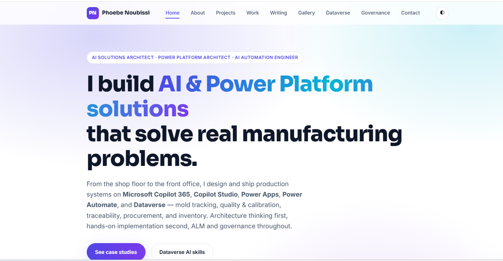

<h1 align="center">Phoebe Noubissi — Portfolio</h1>

<p align="center">
  <strong>AI Solutions Architect · Power Platform Architect · AI Automation Engineer</strong><br />
  Production AI &amp; low-code solutions for manufacturing — Copilot 365, Copilot Studio, Power Apps, Power Automate, Dataverse, AI Builder &amp; Azure.
</p>

<p align="center">
  
  
  
  
  
</p>

<p align="center">
  <a href="https://d365phoebe.com">Website</a> ·
  <a href="https://www.linkedin.com/in/phoebe-noubissi-9bb8983a8/">LinkedIn</a> ·
  <a href="https://www.youtube.com/@Phoebemakescloudsimple">YouTube</a>
</p>

---

A clean, modern, fully responsive single-page portfolio — **no frameworks, no build step, no dependencies**. Just `index.html`, one stylesheet, and one script, ready to host on GitHub Pages. It's framed entirely around **real manufacturing business problems** and the production systems built to solve them.

## 🔗 Live site

> **[https://YOUR-USERNAME.github.io](https://YOUR-USERNAME.github.io)** — replace with your URL after you enable GitHub Pages (see [Deploy](#️-deploy-to-github-pages)).

## 🖼️ Preview



> _Tip: take a screenshot of the live site, save it as `img/site-preview.png`, and this image will render here on the repo home page._

## ✨ Features

- **Fully responsive** — mobile-first, works from ~320px to widescreen
- **Light / dark theme** — respects the visitor's OS preference and remembers their toggle
- **Searchable project inventory** — live keyword filter across **118+ builds** with per-area counts
- **Twelve in-depth case studies** — each as *Problem → Contribution → Stack → Outcome*
- **Dataverse Business Skills (via MCP)** section — how skills are added &amp; triggered, with a manufacturing skills table
- **Writing &amp; Insights** + **Screenshots gallery** (auto-fills from the `img/` folder)
- **Governance / ALM / CI-CD** section — source control, pipelines, environment strategy
- **Accessible &amp; fast** — semantic HTML, `aria` labels, keyboard-friendly, `prefers-reduced-motion`, loads in well under a second

## 🧭 Sections

| # | Section | What it covers |
|---|---------|----------------|
| 01 | About | Manufacturing-focused intro, tech stack, headshot |
| 02 | Capabilities &amp; Projects | Grouped capability cards + the searchable 118-build inventory |
| 03 | Case Studies | Mold maintenance/release tracking, equipment tracker/preventive maintenance, purchase-request approval, purchase-order request canvas app, employee leave tracker, NCR control center, traceability, gage calibration, SharePoint RAG, ProjectHub, Copilot Cowork portfolio widgets, OpsPilot |
| 04 | Writing &amp; Insights | Deep dives on Copilot Studio, Logic Apps, APIM, observability, licensing |
| 05 | Screenshots | App screenshots (drop files into `img/`) |
| 06 | Dataverse AI | Dataverse business skills exposed via the Dataverse MCP server |
| 07 | Governance | Source control, Power Platform Pipelines, Azure DevOps CI/CD, environment strategy |
| 08 | Contact | Email, website, LinkedIn, YouTube, contact form |

## 🗂️ Project structure

```
.
├── index.html        # all page content & structure
├── css/
│   └── style.css     # styling, light/dark theme, responsive layout
├── js/
│   └── main.js       # theme toggle, mobile menu, active-nav, inventory filter, image fallback, animations
├── img/              # your images — headshot (phoebe-avatar.jpg) + screenshots
└── README.md         # this file
```

## 🛠️ Tech stack

Vanilla **HTML5 · CSS3 · JavaScript** — zero dependencies, zero build tooling. Fonts via Google Fonts (Inter + Sora). The *subject matter* is Microsoft Copilot 365, Copilot Studio, Power Apps, Power Automate, Dataverse, AI Builder, Azure Logic Apps, API Management, and Power BI.

## 💻 Run locally

No tooling required — just open `index.html` in a browser. For a local server (so relative paths behave exactly like production):

```bash
# Python 3
python -m http.server 8000
# then visit http://localhost:8000
```

## ☁️ Deploy to GitHub Pages

**Option A — GitHub website (no Git needed):**
1. Create a repo. For a root personal site at `https://<username>.github.io`, name it exactly **`<username>.github.io`**.
2. **Add file → Upload files** → drag in `index.html`, plus the **`css/`, `js/`, and `img/`** folders → **Commit changes**.
3. **Settings → Pages → Build and deployment → Source: Deploy from a branch**.
4. Branch **`main`**, folder **`/ (root)`** → **Save**.
5. Wait ~1 minute, refresh — your live URL appears at the top of the Pages settings.

**Option B — command line:**
```bash
git init
git add .
git commit -m "Add portfolio site"
git branch -M main
git remote add origin https://github.com/<username>/<repo>.git
git push -u origin main
```
Then enable Pages as in steps 3–5 above.

## 🖼️ Adding screenshots

The **Screenshots** section is organized **by project** — larger case studies can include more images, and clicking any image opens a lightbox. A tile shows a placeholder until a file with the matching name exists in `img/`, then swaps to your image automatically. Current filenames:

| Project | Files |
|---------|-------|
| Gage Calibration Register | `gage-1.png` … `gage-5.png` *(already added)* |
| Mold Maintenance, Release &amp; Part Pull Tracker | `mold-maintenance-overview.png`, `mold-maintenance-counters-rework.png`, `mold-release-alert-part-pull.png`, `mold-release-applied-reset.png`, `mold-release-empty-search.png`, `mold-new-upload.png` *(already added)* |
| Equipment Tracker &amp; Preventive Maintenance System | `equipment-tracker-dashboard.png`, `equipment-tracker-equipment-list.png`, `equipment-tracker-criteria-tasks.png`, `equipment-tracker-new-criteria.png`, `equipment-tracker-maintenance-schedule.png`, `equipment-tracker-maintenance-records.png`, `equipment-tracker-escalations.png`, `equipment-tracker-reports.png`, `equipment-tracker-new-equipment.png` *(already added)* |
| Purchase Request Approval | `purchase-1.png`, `purchase-2.png`, `purchase-3.png` |
| Purchase Order Request &amp; Approval Inbox | `por-my-requests.png`, `por-new-request-info.png`, `por-line-items.png`, `por-attachments.png`, `por-review-submit.png`, `por-approval-inbox-single.png`, `por-approval-inbox-multiple.png`, `por-approval-inbox-expanded.png`, `por-approval-decision-casting.png`, `por-approval-decision-cabinet.png` *(already added)* |
| Employee Leave Tracker Canvas App | `employee-leave-dashboard.png`, `employee-leave-team-calendar.png`, `employee-leave-approvals.png`, `employee-leave-new-request.png`, `employee-leave-my-requests.png` *(already added)* |
| OpsPilot Code App — Manufacturing Operations | `opspilot-command-center-kpis.png`, `opspilot-command-center-pagination.png`, `opspilot-my-schedule-selection.png`, `opspilot-stop-outcome-modal.png`, `opspilot-in-progress.png`, `opspilot-history.png`, `opspilot-drop-off-parts.png`, `opspilot-assign-to.png`, `opspilot-assign-tasks.png`, `opspilot-workload.png`, `opspilot-parts-estimates.png`, `opspilot-scheduling-agent.png` *(already added)* |
| ProjectHub Code App — Project Management | `projecthub-projects-overview.png`, `projecthub-projects-filtered-low.png`, `projecthub-new-project-modal.png`, `projecthub-my-tasks-board.png`, `projecthub-edit-task-modal.png`, `projecthub-project-overview-tab.png`, `projecthub-project-milestones-tab.png`, `projecthub-project-links-tab.png`, `projecthub-project-timeline-dark.png` *(already added)* |
| Copilot Cowork Project Portfolio Widgets | `cowork-portfolio-explorer-summary.png`, `cowork-portfolio-explorer-expanded.png`, `cowork-priority-carousel-critical.png`, `cowork-priority-carousel-watch.png`, `cowork-dashboard-overview-tab.png`, `cowork-dashboard-projects-tab.png`, `cowork-dashboard-team-tab.png`, `cowork-dashboard-analytics-tab.png`, `cowork-milestone-met.png`, `cowork-milestone-open.png`, `cowork-milestone-missed.png`, `cowork-personas-count-desc.png`, `cowork-personas-avg-completion.png`, `cowork-personas-avg-completion-asc.png`, `cowork-personas-name-sort.png`, `cowork-portfolio-post.png`, `cowork-portfolio-post-bottom.png`, `cowork-budget-tracker-top.png`, `cowork-budget-tracker-chart.png`, `cowork-portfolio-grid.png`, `cowork-leaderboard.png`, `cowork-roadmap-2026.png`, `cowork-roadmap-detail-modal.png`, `cowork-report-card-status.png`, `cowork-report-card-timeline.png`, `cowork-team-persona-cards.png` *(already added)* |

To add more screenshots, copy a `<figure class="shot">` block in `index.html`, bump the filename (`gage-6.png`, …) and the caption. Full notes are in **`img/README.txt`**. You can upload images **directly on GitHub**: open the `img` folder → **Add file → Upload files** → drag them in → **Commit**.

> ⚠️ **Before uploading any shop-floor screenshot, blur or crop out** real names, serial numbers, customers, and pricing — the site is public.

## 🎨 Customizing

- **Colors** — edit the `--brand`, `--brand-2`, `--brand-3` variables at the top of `css/style.css`.
- **Content** — all text lives in `index.html`.
- **Add a project card** — copy any `<article class="card">…</article>` block.
- **Add a case study** — copy any `<article class="case">…</article>` block.
- **Add an inventory item** — add a `<li class="acc__item">` inside the relevant area in the inventory.

## 🔒 Privacy

This site contains **no tenant IDs, secrets, org URLs, employer name, coworker names, or real record data** — every example is illustrative. Keep it that way when you add screenshots or article links.

## 👩🏽‍💻 About

**Phoebe Noubissi** — AI Solutions Architect & Power Platform Architect. I design and ship production AI and low-code solutions for manufacturing, and teach the Microsoft stack at [d365phoebe.com](https://d365phoebe.com) and on [YouTube](https://www.youtube.com/@Phoebemakescloudsimple).

- 🌐 Website — [d365phoebe.com](https://d365phoebe.com)
- 💼 LinkedIn — [in/phoebe-noubissi](https://www.linkedin.com/in/phoebe-noubissi-9bb8983a8/)
- ▶️ YouTube — [@Phoebemakescloudsimple](https://www.youtube.com/@Phoebemakescloudsimple)
- ✉️ Email — nphoeb@gmail.com

## 📄 License

Code (HTML/CSS/JS structure) is free to reuse as inspiration for your own portfolio. **Content, copy, and images © Phoebe Noubissi** — please don't republish them as your own.


## Latest additions

- Added `assets/power_platform_architecture.html` as an interactive overall Power Platform architecture page.
- Added `assets/purchase_request_schema.html` as an interactive Purchase Request Dataverse schema explorer.
- Added Purchase Request Power Automate routing-flow screenshots to the portfolio gallery.
